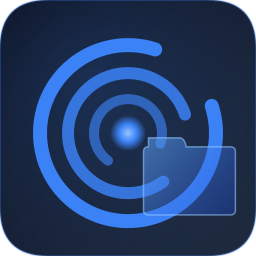

# Vortex File Manager

<div align="center">



**A modern, fast Windows file manager with built-in video player and PDF reader.**

[](https://github.com/RupamSatyaki/VORTEX-File-Manager/releases/tag/v1.0.0)
[](LICENSE)
[](https://www.electronjs.org/)
[](https://github.com/RupamSatyaki/VORTEX-File-Manager/releases)

[Download v1.0.0](https://github.com/RupamSatyaki/VORTEX-File-Manager/releases/tag/v1.0.0) · [Report Bug](https://github.com/RupamSatyaki/VORTEX-File-Manager/issues) · [Request Feature](https://github.com/RupamSatyaki/VORTEX-File-Manager/issues)

</div>

---

## What is Vortex?

Vortex is a Windows file manager built with Electron. It replaces Windows Explorer with a glassmorphism-styled interface, a built-in video player that handles MKV/AVI/WMV via real-time transcoding, a PDF reader, image previews, and full file management — all in one app.

---

## Features

### File Management
- Grid, List, and Details views with sortable columns
- Inline rename, create, delete (sends to Recycle Bin)
- Copy, Cut, Paste with visual feedback
- Drag & Drop — move or copy files between folders
- Multi-select with Ctrl+Click and Shift+Click
- Recycle Bin — browse, restore, and empty
- ZIP compress and extract
- Right-click context menu with full operations

### Navigation
- Windows 11-style breadcrumb address bar with dropdown segments
- Back / Forward / Up history (browser-like)
- Multi-tab browsing with session restore
- Sidebar — Home, Quick Access, This PC, Drives, Portable Devices, Bookmarks
- Real-time drive monitoring — detects USB/phone connect/disconnect
- Recursive search (max 300 results, depth 4)

### Built-in Video Player
- Plays MP4, WebM, M4V directly
- MKV, AVI, WMV, FLV, MOV — real-time H.264 transcoding (GPU-accelerated if available: NVENC, QSV, AMF; CPU fallback)
- Playlist from folder, seek bar with transcoded-progress layer
- Playback speed, volume, Picture-in-Picture, fullscreen
- File info panel with format, size, duration, resolution

### Built-in PDF Reader
- Renders PDFs using PDF.js
- Page navigation, zoom, fullscreen

### Image Preview
- Space key opens inline preview panel
- Zoom, rotate, fullscreen
- Navigate between images in folder

### File Associations (after install)
- Double-clicking any video/audio file in Windows Explorer opens Vortex Player directly
- Double-clicking a PDF opens Vortex PDF Reader
- Appears in Windows "Open With" and "Default Apps" settings

### UI
- Glassmorphism design — transparent window with blur
- Dark and Light themes
- 6 accent colors: Blue, Purple, Pink, Green, Orange, Teal
- Windows-style window controls
- Settings dialog with Default Apps configuration

### Keyboard Shortcuts

| Shortcut | Action |
|---|---|
| `Ctrl+N` | New File |
| `Ctrl+Shift+N` | New Folder |
| `Ctrl+C / X / V` | Copy / Cut / Paste |
| `Ctrl+A` | Select All |
| `Ctrl+F` | Focus Search |
| `Ctrl+L` | Edit Address Bar |
| `Ctrl+T` | New Tab |
| `Ctrl+W` | Close Tab |
| `Ctrl+B` | Toggle Sidebar |
| `Ctrl+1 / 2 / 3` | Grid / List / Details view |
| `F2` | Rename |
| `F5` | Refresh |
| `Delete` | Delete (to Recycle Bin) |
| `Alt+← / →` | Back / Forward |
| `Alt+↑` | Go Up |
| `Space` | Image Preview |
| `Esc` | Clear Search / Deselect |

---

## Installation

### Download (Recommended)

Download the installer from the [Releases page](https://github.com/RupamSatyaki/VORTEX-File-Manager/releases/tag/v1.0.0):

```
Vortex File Manager Setup 1.0.0.exe
```

Run the installer — no admin required for per-user install.

### Build from Source

**Requirements:** Node.js 16+, Windows 10/11

```bash
git clone https://github.com/RupamSatyaki/VORTEX-File-Manager.git
cd VORTEX-File-Manager/vortex-file-manager

npm install

# Development
npm run dev

# Production
npm start

# Build installer
npm run build
```

---

## Tech Stack

| Layer | Technology |
|---|---|
| Framework | Electron 28 |
| Frontend | Vanilla JS + CSS |
| Video transcoding | fluent-ffmpeg + ffmpeg |
| PDF rendering | PDF.js |
| Archive | adm-zip |
| File watching | chokidar |
| Installer | electron-builder + NSIS |

---

## Project Structure

```
vortex-file-manager/
├── main.js                        # Electron main process
├── preload.js                     # IPC bridge (contextBridge)
├── installer.nsh                  # NSIS custom script (file associations)
├── src/
│   ├── main/                      # Main process modules
│   │   ├── mediaServer.js         # Local HTTP server for video
│   │   ├── mkvTranscoder.js       # MKV → MP4 real-time transcoding
│   │   ├── mediaDuration.js       # ffprobe duration detection
│   │   ├── gpuDetect.js           # GPU encoder detection
│   │   ├── videoPlayerWindow.js   # Video player window manager
│   │   ├── appDetector.js         # Installed apps detection (Open With)
│   │   └── scripts/               # PowerShell scripts (Recycle Bin, Terminal)
│   └── renderer/
│       ├── index.html             # Main app HTML
│       ├── css/                   # Stylesheets
│       ├── js/
│       │   ├── core/              # App init, IPC, Events, Storage
│       │   ├── ui/                # Header, Sidebar, FileList, Tabs, etc.
│       │   ├── features/          # Navigation, Selection, CopyPaste, etc.
│       │   ├── utils/             # Path, Format, Icon utilities
│       │   └── preview/           # Image, Video, PDF preview systems
│       ├── video-player/          # Standalone video player window
│       └── pdf-reader/            # Standalone PDF reader window
└── src/assets/icons/              # App icons (PNG + ICO)
```

---

## Roadmap

- [x] Glassmorphism UI with themes and accent colors
- [x] Multi-tab browsing with session restore
- [x] Full file operations (create, rename, delete, copy, move)
- [x] Drag & Drop
- [x] Recursive search
- [x] Live disk usage bars
- [x] Recycle Bin support
- [x] ZIP compress / extract
- [x] Built-in video player with MKV transcoding
- [x] Built-in PDF reader
- [x] Image preview panel with thumbnails
- [x] File associations — open from any explorer
- [x] Windows Default Apps registration
- [x] NSIS installer with registry setup
- [ ] Dual pane view
- [ ] Recent Files
- [ ] Batch rename
- [ ] Cloud storage (Google Drive, OneDrive)
- [ ] MTP / phone browsing
- [ ] Plugin system

---

## License

MIT — see [LICENSE](LICENSE)

---

<div align="center">
Made by <a href="https://github.com/RupamSatyaki">Rupam Satyaki</a>
</div>
